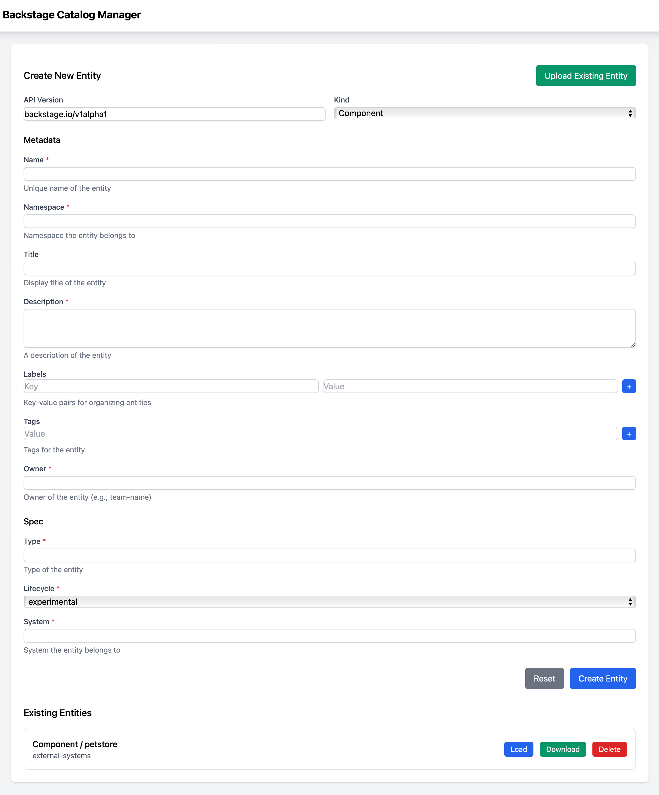

# Backstage Catalog UI

## What is this?

This is a Python Flask Application that presents a simple UI for creating a software catalog component for use with [Backstage](https://backstage.spotify.com).

It is a proof-of-concept to understand what might be possible to assist development teams with bootstrapping their Software Catalogs.



You may:
- Fill in the blanks, and create a catalog entity. It is saved to a Sqlite database.
- Existing entities that have been created are listed at the end of the page. When you download one, you get the YAML for the entity, and this *should* work with Backstage. I have not actually tested this, yet...

## Should I use this?
Maybe. Some caveats.

- This is not complete. It is the simplest example using the basic, core catalog features.
- It's probably buggy.
- It probably doesn't fit your own use case.
- You will need to figure out how to run this and best use it in your own context.
- I have only tested this on macOS. It *should* work anywhere that Python works, but YMMV.

## Running it.
- Create a Python virtualenv. I used Python 3.13.

``` shell
cd ~/my/venv/place
python3 -m venv catalog-ui
cd catalog-ui
source bin/activate  # Obvs, on Windows, use Activate.ps1, unless you have blessed yourself with WSL
```

- Install the requirements

``` shell
pip install -r requirements.txt
```

- Run it.

``` shell
python ./run.py
```

- The service runs on localhost port 8001 by default, but you can change that.

``` shell
python ./run.py --help

usage: run.py [-h] [--host HOST] [--port PORT] [--debug]

Run the Catalog Manager application

options:
  -h, --help   show this help message and exit
  --host HOST  Host to run the application on
  --port PORT  Port to run the application on
  --debug      Run in debug mode
```


## What's next?
- Do something to support annotations, which should be as simple as updating `CATALOG_FIELDS` in `app/schema.py`
